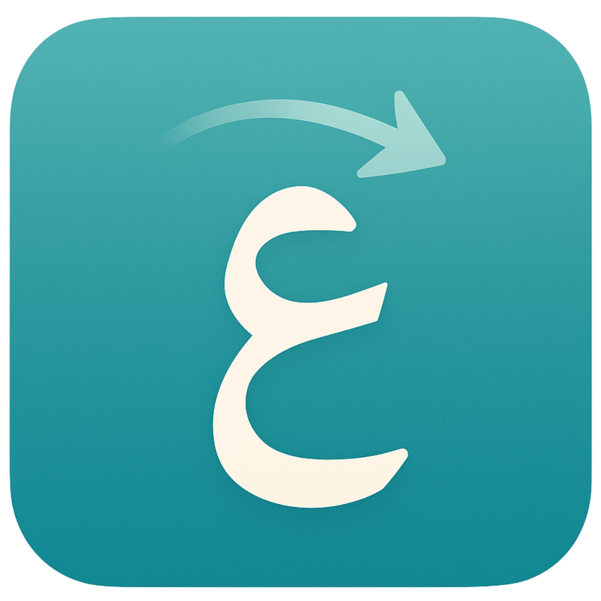
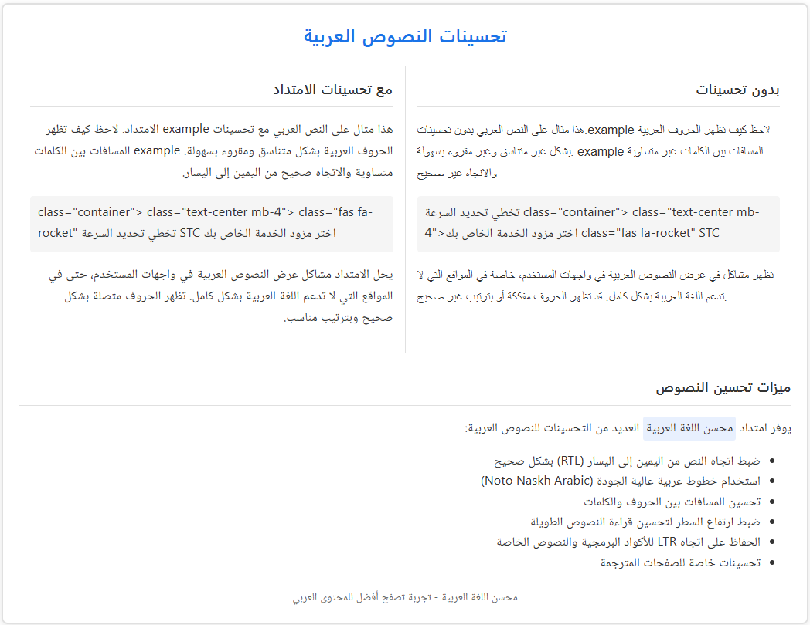
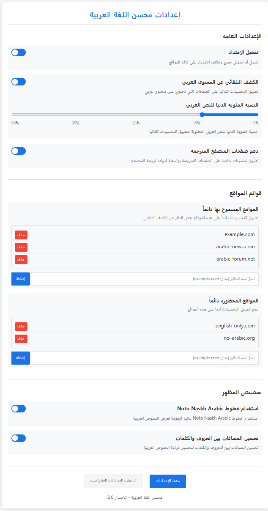
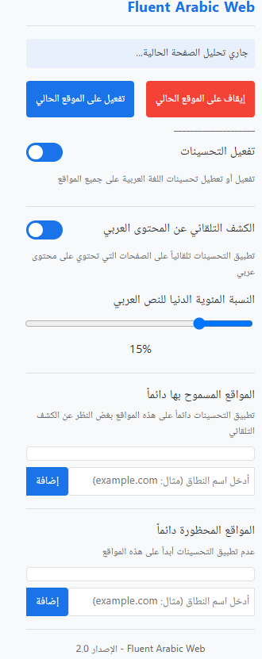

# Fluent Arabic Web (محسن الويب العربي الشامل)

[](https://opensource.org/licenses/MIT)

<p align="center">
  
</p>

**اجعل تصفح الويب باللغة العربية تجربة أكثر سلاسة وطبيعية!**

Fluent Arabic Web هي إضافة للمتصفح (Chrome, Edge، وغيرها من المتصفحات المبنية على Chromium) مصممة لتحسين تجربة قراءة وكتابة اللغة العربية على أي موقع ويب بشكل تلقائي. تكتشف الإضافة وجود محتوى عربي (حتى المحتوى المترجم بواسطة المتصفح) وتقوم بتطبيق التنسيقات اللازمة لجعل النص يتدفق من اليمين لليسار (RTL) وتستخدم خطًا عربيًا محسنًا (Noto Naskh Arabic) لزيادة الوضوح والراحة البصرية.

## ✨ الميزات الرئيسية

*   **الكشف التلقائي عن اللغة العربية:** لا حاجة لتفعيل أو إيقاف الإضافة، فهي تعمل بذكاء في الخلفية.
*   **دعم شامل لـ RTL:** تطبيق اتجاه النص من اليمين لليسار على الفقرات، مربعات الإدخال، والأزرار عند الحاجة.
*   **تحسين الخط:** استخدام خط Noto Naskh Arabic المحلي (مضمّن في الإضافة) لتحسين قابلية القراءة والجمالية.
*   **توافق واسع:** تعمل على معظم مواقع الويب، بما في ذلك تطبيقات الدردشة، المنتديات، المواقع الإخبارية، وغيرها.
*   **متوافقة مع ترجمة المتصفح:** تعمل بشكل جيد مع ميزات الترجمة المدمجة في المتصفح (مثل Google Translate).
*   **تطبيق شرطي:** لا تؤثر على المواقع أو أجزاء الصفحات التي لا تحتوي على نصوص عربية للحفاظ على التصميم الأصلي.
*   **خفيفة الوزن:** تركز على أداء وظيفتها الأساسية بكفاءة.
*   **تحافظ على تنسيق الكود:** تضمن بقاء كتل الأكواد البرمجية (`<pre>`, `<code>`) باتجاه من اليسار لليمين (LTR) وخطها الأصلي.

## 🚀 كيف تعمل؟
<p align="center">
  
</p>

1.  **المراقبة:** تراقب الإضافة التغييرات في محتوى الصفحة التي تتصفحها.
2.  **الكشف:** تبحث عن وجود أحرف عربية في النص الظاهر.
3.  **التفعيل:** إذا تم اكتشاف عدد كافٍ من الأحرف العربية، تضيف الإضافة فئة CSS خاصة (`arabic-enhancer-active`) إلى عنصر `<html>` في الصفحة.
4.  **التنسيق:** يتم تطبيق مجموعة من قواعد CSS (المخزنة في `arabic-styles.css`) التي تستهدف هذه الفئة، مما يؤدي إلى تغيير اتجاه النص وتحسين الخط.
5.  **إلغاء التفعيل:** إذا اختفى المحتوى العربي من الصفحة، تتم إزالة الفئة وتعود الصفحة إلى تنسيقها الأصلي.

## 🔧 التثبيت

**الطريقة الحالية (للمطورين والمستخدمين المتقدمين):**

1.  قم بتحميل ملفات الإضافة (أو استنسخ المستودع `git clone ...`).
2.  افتح متصفح Chrome أو Edge.
3.  اذهب إلى صفحة الإضافات:
    *   Chrome: `chrome://extensions/`
    *   Edge: `edge://extensions/`
4.  قم بتفعيل "وضع المطور" (Developer mode) في الزاوية العلوية اليمنى.
5.  انقر على "تحميل إضافة تم فك حزمتها" (Load unpacked).
6.  حدد المجلد الذي يحتوي على ملفات الإضافة (المجلد الذي يحتوي على `manifest.json`).

**من متجر Chrome Web Store:** *✨ (قريبًا) ✨*
*   سيتم توفير رابط هنا بمجرد نشر الإضافة على المتجر الرسمي.

## ⚙️ الاستخدام
<div align="center">
  
  
</div>


بمجرد تثبيت الإضافة، ستبدأ بالعمل تلقائيًا على أي صفحة ويب تزورها تحتوي على اللغة العربية. يمكنك التحكم في الإعدادات من خلال النقر على أيقونة الإضافة في شريط المتصفح:

* **تفعيل/تعطيل الإضافة:** يمكنك تفعيل أو تعطيل الإضافة بشكل كامل.
* **إيقاف على الموقع الحالي:** إضافة الموقع الحالي إلى القائمة السوداء لمنع تطبيق التحسينات عليه.
* **تفعيل على الموقع الحالي:** إضافة الموقع الحالي إلى القائمة البيضاء لتطبيق التحسينات عليه دائمًا.
* **الكشف التلقائي:** تفعيل أو تعطيل الكشف التلقائي عن المحتوى العربي.
* **النسبة المئوية الدنيا للنص العربي:** تحديد النسبة المئوية الدنيا للنص العربي المطلوبة لتطبيق التحسينات.
* **إدارة القوائم:** إضافة أو إزالة مواقع من القائمة البيضاء أو السوداء.

## 🐞 الإبلاغ عن المشاكل والمساهمة

*   إذا واجهت أي مشكلة (مثل تداخل النصوص، عدم عمل الإضافة على موقع معين، أو تأثيرها على موقع إنجليزي)، يرجى فتح "Issue" جديدة في هذا المستودع مع ذكر التفاصيل التالية:
    *   رابط الموقع الذي ظهرت فيه المشكلة.
    *   وصف للمشكلة.
    *   لقطة شاشة (إذا أمكن).
*   نرحب بالمساهمات لتحسين الإضافة! يمكنك عمل Fork للمستودع وتقديم Pull Request بالتغييرات المقترحة.

## 📄 الترخيص

هذه الإضافة مرخصة تحت ترخيص MIT. انظر ملف `LICENSE` للمزيد من التفاصيل.

## 🧩 هيكل المشروع

```
extension-folder/
├── manifest.json       # ملف تعريف الامتداد
├── content.js          # سكريبت المحتوى لتطبيق التحسينات
├── background.js       # سكريبت الخلفية لإدارة الإعدادات
├── arabic-styles.css   # تنسيقات CSS للغة العربية
├── popup.html          # واجهة المستخدم المنبثقة
├── popup.js            # سكريبت واجهة المستخدم
├── icon.png            # أيقونة الامتداد
└── fonts/              # مجلد الخطوط العربية
    ├── NotoNaskhArabic-Regular.woff2
    └── NotoNaskhArabic-Bold.woff2
```

---

نأمل أن تجعل Fluent Arabic Web تصفحك للويب باللغة العربية أكثر متعة وإنتاجية!
